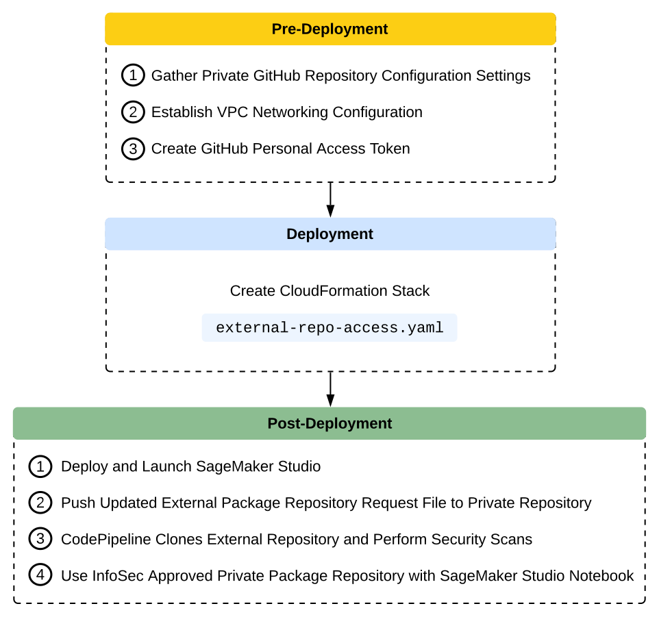
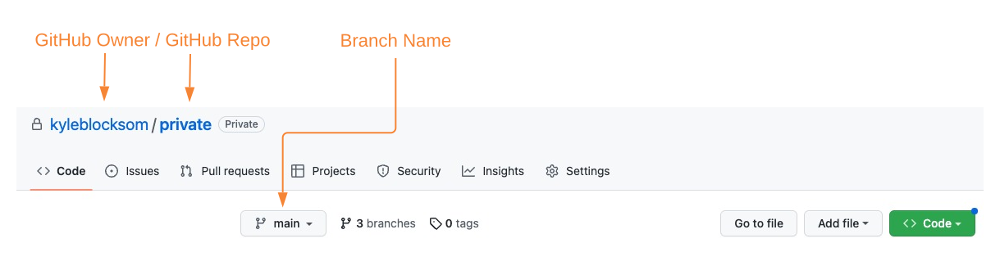

# Deployment Guide
---
## Deployment Workflow
The below workflow diagram visualizes the end-to-end deployment process that is detailed within this guide. The resultant architecture includes an AWS CodePipeline worfklow orchestration that triggers based on a token-authenticated webhook with your internal private GitHub repository. The worfklow consists of an AWS CodeBuild project to clone remote package repositories so that an additional CodeBuild project can be used to complete static application security testing, software composition analysis, dynamic code analysis, and image vulnerability scanning.

<p align="center">
  
</p>

## Pre-Deployment
By default, AWS CloudFormation uses a temporary session that it generates from your user credentials for stack operations. If you specify a service role, CloudFormation will instead use that role's credentials.

To deploy this solution, your IAM user/role or service role must have permissions to deploy the resources specified in the CloudFormation template. For more details on AWS Identity and Access Management (IAM) with CloudFormation, please refer to the [AWS CloudFormation User Guide](https://docs.aws.amazon.com/AWSCloudFormation/latest/UserGuide/using-iam-template.html).

You must also have [AWS CLI](https://aws.amazon.com/cli/) installed. For instructions on installing AWS CLI, please see [Installing, updating, and uninstalling the AWS CLI](https://docs.aws.amazon.com/cli/latest/userguide/cli-chap-install.html). If you would like to use the multi-account model deployment option described later, you need access to two AWS accounts minimum, recommended three accounts for development, staging, and production environments.

### Establish VPC Networking Configuration
This solution requires private VPC subnets into which you can deploy CodePipeline and CodeBuild. These private subnets must be deployed into a VPC that is also configured with a NAT Gateway (NGW) in a public subnet to facilitate internet ingress and egress through an Internet Gateway (IGW).

If your environment does not have the required VPC, subnets, NAT Gateway, and Internet Gateway configuration, you can create those by launching the following [CloudFormation template](https://github.com/awsdocs/aws-lambda-developer-guide/blob/master/templates/vpc-privatepublic.yaml).

### Create Personal Access Token (PAT)
To authenticate with your private repository, you will use a PAT. With GitHub, you may prefer to use a [GitHub App](https://docs.github.com/en/apps/creating-github-apps/creating-github-apps/about-apps) to access resources on behalf of an organization or for long-lived integrations. To create your PAT, please follow the GitHub instructions for [creating a personal access token (classic)](https://docs.github.com/en/authentication/keeping-your-account-and-data-secure/creating-a-personal-access-token#creating-a-personal-access-token-classic). Make note of your PAT before closing your browser as you will use it for AWS Secrets Manager configuration below.

Publish your PAT to AWS Secrets Manager using the AWS Command Line Interface (AWS CLI):

```sh
SECRETS_MANAGER_PAT_ARN=$(aws secretsmanager create-secret --name github-pat \
--secret-string <your GitHub PAT> --query ARN --output text)
```
Make a note of the Secret name ('github-pat' by default), which you will input later as the _GitHubToken_ CloudFormation parameter.

### Gather Private GitHub Repository Configuration Settings
The CloudFormation template requires a total of eleven user-defined parameters, three of which are specific to your internal private GitHub repository.

Navigate to your private GitHub repository and note the owner, repository, and branch names:

<p align="center">
  
</p>

#### Optional - Run Security Scan on the CloudFormation Templates
If you would like to run a security scan on the CloudFormation templates using [`cfn_nag`](https://github.com/stelligent/cfn_nag) (recommended), you have to install `cfn_nag`:
```sh
brew install ruby brew-gem
brew gem install cfn-nag
```

To initiate the security scan, run the following command:
```sh
git clone https://github.com/aws-samples/sagemaker-external-repo-access.git
cd ../cfn/
cfn_nag_scan --input-path ./external-repo-access.yaml
```

## Deployment 
The following section provides instructions for deploying the paramterized [external-repo-access.yaml](../cfn/external-repo-access.yaml) CloudFormation template into your AWS account. You can also deploy the solution using the [create-stack.sh](../shell/create-stack.sh) shell script. 

❗ Both deployment options require that you specify valid CloudFormation paramaters for your prerequisite AWS resources (e.g., VPC, subntes, S3 bucket) and GitHub environment settings (e.g., GitHubBranch, GitHubOwner, GitHubToken) to be used for stack deployment. Set the corresponding CloudFormation parameters to the names, values, and resource IDs of your existing resources.

The stack (`external-repo-access.yaml`) provisions the following primary resources:
1. CodePipeline Pipeline to orchestrate solution workflow.
2. CodePipeline Artifact Bucket and KMS Key to securely store compressed stage input and output artifacts.
3. CodePipeline Webhook to invoke CodePipeline execution based on user commits to specified GitHub repo and branch.
4. CodePipeline Source Stage _GitHub_Private_Repository_Pull_ to retrieve filtered source changes.
5. CodePipeline Build Stage _Clone_External_Repo_ to clone external package repository.
6. CodePipeline Build Stage _Security_Scans_ to execute third-party agent-based static application security testing, software composition analysis, dynamic code analysis, and image vulnerability scans.
7. CodePipeline Build Stage _GitHub_Private_Repository_Push_ to push InfoSec validated external package repository to internal private GitHub repository (assuming acceptable severity findings).

CloudFormation prepopulates stack parameters with the default values provided in the template. To provide alternative input values, you can specify parameters via `ParameterKey=<ParameterKey>,ParameterValue=<Value>` pairs in the `aws cloudformation create-stack` call. The following series of commands clones the _sagemaker-external-repo-access_ repository to your local machine so you can then create the stack using AWS CLI commands:

```sh
# If not already cloned, clone remote repository and change working directory to CloudFormation folder
git clone https://github.com/aws-samples/sagemaker-external-repo-access.git
cd sagemaker-external-repo-access/cfn/

# Use defaults or provide your own parameter values
STACK_NAME="external-repo-access"
CODEPIPELINE_NAME="external-repo-pipeline"

# Below parameter values acquired from 'Gather Private GitHub Repository Configuration Settings' pre-deployment section
GITHUB_BRANCH=<private repository branch>
GITHUB_OWNER=<private repository owner>
GITHUB_REPO=<private repository name>
GITHUB_TOKEN=<AWS Secrets Manager name for private repository PAT>

# Below parameter values acquired from 'Establish VPC Networking Configuration' pre-deployment section
VPC_ID=<vpc with NGW and IGW>
SUBNET_ID1=<private subnet 1 from above VPC>
SUBNET_ID2=<private subnet 2 from above VPC>

aws cloudformation create-stack \
--stack-name ${STACK_NAME} \
--template-body file://$(pwd)/cfn/external-repo-access.yaml \
--parameters ParameterKey=SourceActionVersion,ParameterValue=${SOURCE_VERSION} \
ParameterKey=CodePipelineName,ParameterValue=${CODEPIPELINE_NAME} \
ParameterKey=GitHubBranch,ParameterValue=${GITHUB_BRANCH} \
ParameterKey=GitHubOwner,ParameterValue=${GITHUB_OWNER} \
ParameterKey=GitHubRepo,ParameterValue=${GITHUB_REPO} \
ParameterKey=GitHubToken,ParameterValue=${GITHUB_TOKEN} \
ParameterKey=RepoCloneLambdaSubnet,ParameterValue=${SUBNET_ID1}\\,${SUBNET_ID2} \
ParameterKey=RepoCloneLambdaVpc,ParameterValue=${VPC_ID} \
--capabilities CAPABILITY_IAM
```

The previous command launches the stack deployment and returns the `StackId`. You can track the stack deployment status in [AWS CloudFormation console](https://console.aws.amazon.com/cloudformation/home?region=us-east-1#/stacks?filteringStatus=active&filteringText=&viewNested=true&hideStacks=false) or in your terminal with the following command:

```sh
aws cloudformation describe-stacks \
    --stack-name $STACK_NAME \
    --query "Stacks[0].StackStatus"
```

After a successful stack deployment, the status changes from `CREATE_IN_PROGRESS` to `CREATE_COMPLETE`.

## Post-Deployment
We are using a token-based webhook to connect from the private GitHub repository to CodePipeline. The webhook token ensures that POST requests sent to the payload URL originate from your private repo. When you set a token, you will receive the X-Hub-Signature and X-Hub-Signature-256 headers in the webhook POST request.

With your webhook in place, you are now ready to deploy and launch your SageMaker Studio environment. From your SageMaker Studio environment, you will pull the current version of the public repository request CSV file from your private GitHub repository, append the desired additional public repositories to the request record, then push the updated request file back to the private repository. CodePipeline execution will follow and your external package repository will scanned for InfoSec approval. Please continue to _Testing and Validation_ for step-by-step guidance.

## Testing and Validation
see [Testing and Validation](../documentation/testing-and-validation.md)

---

## README
see [README](../README.md)

---

Copyright Amazon.com, Inc. or its affiliates. All Rights Reserved.
SPDX-License-Identifier: MIT-0
